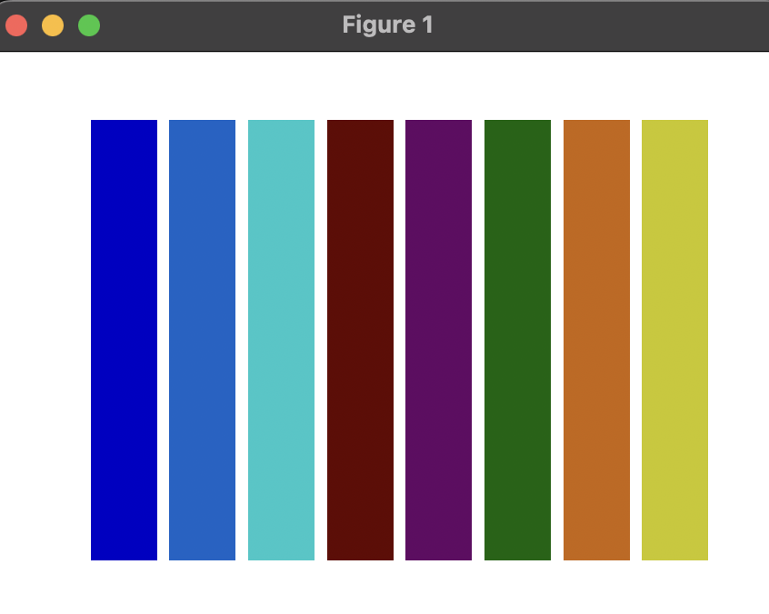

# Visualise the detected colors



## Requirements

Python 3.x

## Setup

### 1. Create a Virtual Environment

Create a virtual environment to manage dependencies. Run the following command in your terminal:

```sh
python3 -m venv venv
```

### 2. Activate the Virtual Environment

On macOS and Linux:

```sh
source venv/bin/activate
```

On Windows:

```sh
venv\Scripts\activate
```

### 3. Install Dependencies

```sh
pip install -r requirements.txt
```

### 4. Run the Script

```sh
python color.py
```

Voila !
